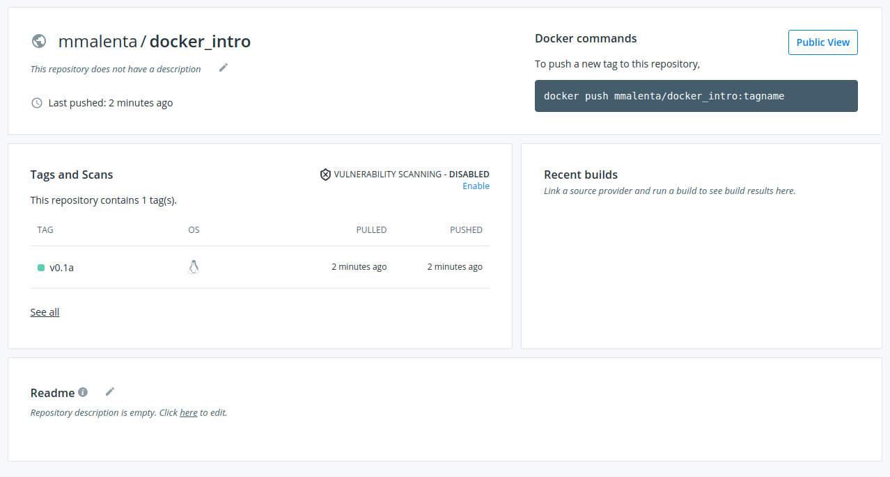

- [0. Logistics](#0-logistics)
- [1. Containers introduction](#1-containers-introduction)
  - [1.1 What are containers](#11-what-are-containers)
  - [1.2 What containers are not](#12-what-containers-are-not)
  - [1.3 Why do you (and don't) need containers](#13-why-do-you-and-dont-need-containers)
- [2. Docker introduction](#2-docker-introduction)
  - [2.1 Basic components of Docker](#21-basic-components-of-docker)
  - [2.2 Building Docker containers](#22-building-docker-containers)
- [3. Docker build process deep dive](#3-docker-build-process-deep-dive)
  - [3.1 Build context](#31-build-context)
  - [3.2 Efficient and safe build of containers](#32-efficient-and-safe-build-of-containers)
  - [3.3 Reducing the size of containers](#33-reducing-the-size-of-containers)
- [4. Docker deployment deep dive](#4-docker-deployment-deep-dive)
  - [4.1 Running containers efficiently and safely](#41-running-containers-efficiently-and-safely)
  - [4.2 Distributing images](#42-distributing-images)
- [5. Summary and recommended resources](#5-summary-and-recommended-resources)

# 0. Logistics

**<h3>Section length: 5 minutes</h3>**

**Course organisation:** This course is designed to be a standalone, 1.5-2h
tutorial / workshop. It is designed with Docker novices in mind and as such
convers mainly introductory containers and Docker concepts. However, some
concepts covered during this workshop, such as streamlining the build process
can be of interest to the regular Docker practitioners. 
If you are already familiar with container and Docker basics and are
following this course on your own, you may skip Sections 1 and 2 and
go directly to Sections [3](#3-docker---build-process-deep-dive) and
[4](#4-docker---deployment-deep-dive).

Further reading for more advanced users and those who would like to go beyond
the scope of this course is given in
[Section 5.](#5-summary-and-recommened-resources) 

**Course timeline:**

Section | Section Name | Length
--------|--------------|-------
0 | Logistics | **5 minutes**
1 | Containers Introduction | **5 minutes**
1.1 | What are containers | 2 minutes
1.2 | What containers are not | 2 minutes
1.3 | Why do you (and don't) need containers | 1 minute
2 | Docker introduction | **40 minutes**
2.1 | Basic components of Docker | 20 minutes
2.2 | Building Docker containers | 20 minutes
3 | Docker build process deep dive | **35 minutes**
3.1 | Build context | 5 minutes
3.2 | Efficient and safe build of containers | 10 minutes
3.3 | Reducing the size of containers | 20 minutes
4 | Docker deployment deep dive | **30 minutes**
4.1 | Running containers efficiently and safely | 20 minutes
4.2 | Distributing containers | 10 minutes
5 | Summary and recommended resources | **5 minutes**
&nbsp; | **Total** | **120 minutes**

**Code and lesson notes:** This README file serves as a master document for
the entire course. All the code is presented in the form of snippets in here.
Each section has a corresponding directory containing the full code and
separate lesson files with information relevant to just that given section.
These files do not contain any additional information and are used to separate
the content into more logical chunks. These directories also contain the
multimedia files, such as images, used in the corresponding course sections.

**Conventions used in this document:**

* [internal links are normal](README.md)
* [**external links are bold**](https://example.com)

* 
  ```
  long(er) code or short commands that are just being
  introduced use code blocks
  ```
* `short commands that are not new and file paths` are inlined

**Software installation:** To get the most out of this course it is essential
that you try the examples and run the code provided. To do that, you will
need a computer with a working Docker installation. Please go to the
[**official Docker installation guide**](https://docs.docker.com/get-docker/)
and follow the instructions to install Docker for your operating system.
This course will be focused on the introductory Docker uses and is expected
to work on all the supported platforms. We recommend you **try to install the
software at least few days before the workshop**, so that you have all the
required software on the day. We also recommend that you 
[**create a Docker Hub account**](https://hub.docker.com/signup) for the last
session on this workshop.


**Installation drop-in session:** Even though Docker is now officialy supported
on the most popular Operating Systems, as with any software there can be some
problems with the installation and the initial configuration. To make sure that
there are no problems on the day of the workshop, we will be organising an
installation drop-in session a few days before the workshop. **If you would like
to receive any help with the installation and setup procedures, please register
your interest [using this form](https://example.com).**

**Bugs and suggestions:** If you find a mistake in the course, be it a code
mistake or a small typo, or have suggestiosn on how to improve this course
please let us know by
[**starting a new issue**](https://github.com/mmalenta/docker_tutorial/issues/new).
We welcome all the suggestions on how to make this course more effective and
efficient at introducing researchers to good containerisation practices.

# 1. Containers introduction
**<h3>Section length: 5 minutes</h3>**
## 1.1 What are containers
**<h3>Section length: 2 minutes</h3>**

You may hear people say they are "running an image" or "running a container". These
terms are often (incorrectly!?) used interchangeably. 

In this workshop, we refer to a (container) image as the collection of
software that you build up and  bundle together. You then can run this image. 
At that point it becomes a container, where you can run your software and perform all the other operations
you would normally perform on your host Operating System (OS). Think of it as 
similar to the difference between an `.exe` file and a running application that
clicking this file starts. `.exe` file has all the components necessary to run the application,
but you actually have to run it to make use of it.

The most important feature of containers, and where their real strength comes from, is that 
unlike "regular" applications, they can and often do perform all their work in isolation.
Your containers do not have to know what the rest of your OS is up to. 
They don't even have to have an access to the same files as your host OS 
(although, as we will see later, you can enable this access), or share the same network 
(again it is possible to achieve that, but it's not the default setting).


## 1.2 What containers are not
**<h3>Section length: 2 minutes</h3>**

You will often hear the expression that "containers are like VMs", or 
"like VMs, but lighter". This may make sense on the surface: there
are fewer moving components in the case of containers and the end result
might be the same for the end user.

Containers remove a lot of components of virtual machines though: they do not
virtualise the hardware, they do not have to contain a fully-fledged
guest OS to operate. They have to rely on the host OS instead.

For a more in-depth explanation of the differences between VMs and
containers, please [**see this website by the IBM Cloud Team**](https://www.ibm.com/cloud/blog/containers-vs-vms)

## 1.3 Why do you (and don't) need containers
**<h3>Section length: 1 minute</h3>**
* Containers will provide a reproducible work environment.
* They go beyond just sharing your code: you provide a fully-working software
with all its required dependencies (modules, libraries, etc.).
* You can build self-contained images that meet the particular needs of your
  project. No need to install software "just in case", or install something to
  be used just once.
* You are no longer tied to the software and library versions installed on your host system.
  Need python3, but only python2 is available? There is an image for that.

&nbsp;

* Your software still depends on hardware you run it on - make sure
your results are consistent across different hardware architectures.
* Not the best for sharing large amounts of data
(see [Section 4.1](#41-running-containers-efficiently-and-safely)) inside
the image (same as you wouldn't use git to share a 10GB file).
* Additional safety concerns, as Docker gives extra power to the user "out of the box".
There is potential to do some damage to the host OS by an inexperienced or
malicious user if Docker is not configured and used properly.

# 2. Docker introduction
**<h3>Section length: 40 minutes</h3>**
## 2.1 Basic components of Docker

**<h3>Section length: 20 minutes</h3>**

Now that we covered the basic ideas behind images and containers, it is time to focus
on one technology in particular - Docker.
Since its initial release in 2013, Docker has been widely adopted in many areas of
research and the ‘industry‘. It is used to provide access to
e-commerce and streaming services, machine learning platforms, scientific
pipelines (CERN, SKA, NASA).

More generally, you should use it as a tool for distributing consistent
software environments. Currently it is only one of many existing container 
technologies that researchers can choose from. Two popular alternatives
are [**Singularity**](https://singularity.hpcng.org) and 
[**Podman**](https://podman.io).
Some solutions offer better support for High Performance Computing, 
while others provide a low-level control of the environment. There really
is something for everyone.

It is possible that after taking this course and familiarising
yourself with other containerisation solutions, you will decide that Docker
is not the ideal fit for your requirements.
Despite the strong competition and some shortcomings, Docker is still 
a popular choice and is often seen as a standard for containers.

<br>

**You should have Docker installed by now.** For our first exercise / example,
we will run a short Docker command to download the *Hello World* of 
**Docker images** and start our very first **Docker container**.

```docker

$ docker container run hello-world

Unable to find image 'hello-world:latest' locally
latest: Pulling from library/hello-world
b8dfde127a29: Pull complete 
Digest: sha256:9f6ad537c5132bcce57f7a0a20e317228d382c3cd61edae14650eec68b2b345c
Status: Downloaded newer image for hello-world:latest

Hello from Docker!
This message shows that your installation appears to be working correctly.

To generate this message, Docker took the following steps:
 1. The Docker client contacted the Docker daemon.
 2. The Docker daemon pulled the "hello-world" image from the Docker Hub.
    (amd64)
 3. The Docker daemon created a new container from that image which runs the
    executable that produces the output you are currently reading.
 4. The Docker daemon streamed that output to the Docker client, which sent it
    to your terminal.

To try something more ambitious, you can run an Ubuntu container with:
 $ docker run -it ubuntu bash

Share images, automate workflows, and more with a free Docker ID:
 https://hub.docker.com/

For more examples and ideas, visit:
 https://docs.docker.com/get-started/


```

**<h3>Let's examine the command and the generated output step by step.</h3>**

* **The command that we execute**
  
    ```docker
    $ docker container run hello-world
    ```

    instructs Docker that we would like to start a container using a `hello-world`
    image. This command can also be written as `docker run hello-world`, omitting 
    the `container` part. This change was 
    [**introduced in 2017**](https://www.docker.com/blog/whats-new-in-docker-1-13/)
    with a major overhaul of the Docker CLI (Command Line Interface). If the version
    of Docker installed on your machine, comes from before these changes were
    introduced (we strongly recommend that you upgrade it due to security reasons),
    the full command will not work and you will have to use the short version.
    This course however is written with the new versions of Docker in mind and 
    will **follow the convention of using the extended versions of the commands**.

* **The next few lines**

    ```
    Unable to find image 'hello-world:latest' locally
    latest: Pulling from library/hello-world
    b8dfde127a29: Pull complete 
    Digest: sha256:9f6ad537c5132bcce57f7a0a20e317228d382c3cd61edae14650eec68b2b345c
    Status: Downloaded newer image for hello-world:latest
    ```

    tells us that Docker was not able to find this image on our machine and 
    has to download it from the external repository (more about repositories 
    in [Section 4.2](#42-distributing-containers)). If you have used this 
    particular image in the past (when for example testing your Docker
    installation from [Section 0](#0-logistics)), you will not see any
    information about Docker trying to download the image.

    You could also separate the `docker container run ...` command above into two instructions:
    ```docker
    $ docker image pull hello-world
    $ docker container run hello-world
    ```
    In this case we are very explicit and tell Docker to first download (pull) the
    image from the external repository and then start the container based on
    that image. If you already have the image on your host machine, you can
    skip the `pull` command. In this case, including the `docker image pull` 
    command separately can be seen as a bit redundant as Docker takes care of any missing
    images with `docker container run`. You can however just pull the image
    and not run it at all, or pull it when you have access to the Internet and 
    later start the container when you are offline.

* **The rest of the output**

    The rest of the output is the most interesting part. It is an
    innocent-looking list, but as items 3 and 4 from that list explain, that
    particular part of the output was generated INSIDE the container and only
    then sent back to the terminal for us to see. That means we have **successfully
    created and run our very first Docker container**.

**<h3>There are a few things we can do after running this command</h3>**

* **Examine the list of locally stored images**

    How does Docker know whether it has to download the image or that the 
    image is already present on your computer? Can you have this knowledge as
    well? Docker keeps track of all the images and layers that you download.
    There usually is a directory on your system which contains all the
    currently downloaded images and the associated SHA256 keys used to identify
    them. This ensures that the same layer or image is not downloaded twice and can be reused
    if necessary. For an in-depth description on how Docker stores images, please refer to
    [**this help guide**](https://docs.docker.com/storage/storagedriver/).
    
    The placement and structure of relevant directories can be
    different depending on your Docker installation and require root
    permissions to access. There is however a short command that lists all the
    locally available images:

    ```docker
    $ docker image ls
    ```

    Depending on how long (if at all) you have been using Docker for, the
    output will show only a single image that we have used above or multiple 
    (as many as few tens of) images, as seen below (this is what I see when I
    run the above command on my work PC - **you will see something different**)

    ```docker
    REPOSITORY                 TAG                      IMAGE ID       CREATED         SIZE
    <none>                     <none>                   670fa2d9f98c   2 months ago    3.14GB
    <none>                     <none>                   2187b33a009b   2 months ago    714MB
    <none>                     <none>                   16b9ad7fc05d   2 months ago    3.12GB
    python                     3.7-alpine               6c59ae21a586   2 months ago    41.6MB
    redis                      alpine                   f7cdff500577   2 months ago    32.3MB
    ubuntu                     18.04                    3339fde08fc3   3 months ago    63.3MB
    nvidia/cuda                10.0-devel-ubuntu18.04   f1cb864ecfaf   3 months ago    2.24GB
    nvidia/cuda                10.2-devel-ubuntu18.04   5fe1e15ef79b   3 months ago    2.96GB
    hello-world                latest                   d1165f221234   3 months ago    13.3kB
    jupyter/scipy-notebook     latest                   dab5e9968512   7 months ago    2.7GB
    nvidia/cuda                9.2-cudnn7-devel         0a6a8962363e   8 months ago    2.88GB
    nvidia/cuda                9.2-base                 7def1f9b9d8d   9 months ago    80.8MB
    nvidia/cuda                9.2-base-ubuntu18.04     7def1f9b9d8d   9 months ago    80.8MB
    nvidia/cuda                9.2-devel-ubuntu18.04    b06eca0e3d4a   9 months ago    2.2GB
    cuda                       8.0-base-ubuntu16.04     f240c010c4f2   10 months ago   142MB
    ubuntu                     16.04                    005d2078bdfa   14 months ago   125MB
    rabbitmq                   3.8.2                    b8956a8129ef   16 months ago   151MB
    nvidia/cuda                9.2-devel-ubuntu16.04    1874839f75d5   19 months ago   2.35GB
    nvidia/cuda                10.0-base-ubuntu18.04    841d44dd4b3c   19 months ago   110MB
    ```

    If you know its name, you can list just a specific image:

    ```docker
    $ docker image ls hello-world
    ```

    or even use wildcards if you are not sure about the full image name
    (was it `hello-world` or `hello_world`?):

    ```docker
    $ docker image ls hello*
    ```

    We can now examine in detail the output of one of the above commands:

    ```docker
    REPOSITORY    TAG       IMAGE ID       CREATED        SIZE
    hello-world   latest    d1165f221234   3 months ago   13.3kB
    ```

    This output tells us that there is a single image starting with the word `hello` available locally on our machine (`hello-world` to be exact), with the `latest` tag. 
    We will talk more about the importance of tags in
    [Section 2.2](#22-building-and-deploying-docker-containers) - for now just
    treat them as an extra bit of information about the version of the image.
    Next comes the image ID, which is a shortened version of the SHA256 key (or digest, 
    using Docker vocabulary) used to identify the image, information on when the image was
    created. This information refers to when the image was first built and not pulled - this 
    particular image was created 3 months ago, even though
    I had downloaded it only 2 minutes before pasting this output in the
    snipped above. At the end, the size of the image is shown. 

    We have used the most basic version of the image listing command, with the
    exception of using wildcards. For a complete reference and advanced examples, 
    such as formatting and filtering, please visit
    [**this docker images reference**](https://docs.docker.com/engine/reference/commandline/images/).
    **Quick note:** the above document refers to a `docker images` command,
    which is *an alias* to the full `docker image ls` command. All the options
    however will work with both versions of this command. You can still use it as
    a reference for the `--format` and `--filter` options.

* **Examine currently running images**

    We can examine currently running images using command familiar to Linux users:
    ```docker
    $ docker ps
    ```
    If you execute this command after launching our first container you will see...
    ```docker
    CONTAINER ID   IMAGE     COMMAND   CREATED   STATUS    PORTS     NAMES
    ```
    nothing really. This means there are no containers running at this moment
    in time. 
    
    When we launched our `hello-world` container above, it started, it
    did the job it was designed to do and it stopped immediately. In the case
    of the `hello-world` image, the designers decided it should print out a helpful
    output once the container is launched successfully, but that may not always 
    be the case. 
    
    We still have an option to check whether our container was started at all. We can force Docker to list *all* the containers with the extra `-a` option:
    ```
    $ docker ps -a
    CONTAINER ID   IMAGE                   COMMAND                  CREATED        STATUS                    PORTS     NAMES
    7dd021096f75   hello-world             "/hello"                 3 hours ago    Exited (0) 3 hours ago              trusting_herschel

    ```
    In this case we actually get some useful information about our container 
    we have just run. We see that we
    launched the container, it run and it exited with code 0, meaning a
    successful, error-free execution. We can also see when the container was
    created and when it completed its execution. As you have seen, we get the
    results from the `hello-world` container pretty much immediately, and
    therefore the `CREATED` and `Exited` times are the same, but generally this
    is not the case. 
    
    Every container has
    a "human-readable" name assigned to it at launch. It makes it easier to
    refer to the container using that name instead of the container ID, listed
    in the first column of the above output. These names are randomly generated
    from a list of adjectives and famous scientists and Docker
    does not guarantee the name will repeat for the same container (it is
    extremely unlikely your container will have the same name as the one
    listed above).
    
    It is therefore important to provide a memorable name with
    the `run` command using `--name` option to ensure reproducible and
    predictable deployment. This is especially important when you run multiple 
    containers at the same time, e.g. making it easy to differentiate front- and 
    backend Node-based containers that can have the same underlying image, or 
    rely on scripts and want to have predictable parameters.
    Naming of containers will be discussed in more
    detail in [Section 4.1](#41-running-containers-efficiently-and-safely).

    If you are running containers right now, you will see them as "Up", as
    below
    ```docker
    $ docker ps -a
    CONTAINER ID   IMAGE            COMMAND                  CREATED        STATUS         PORTS     NAMES
    f1d9fa05caae   rabbitmq:3.8.2   "docker-entrypoint.s…"   2 months ago   Up 5 minutes             rabid_rabbit
    ```

* **Remove the container**

    Exited containers
    can be thought of as being hibernated - they are not running, their
    internal state is saved and they can be woken up and run again. 
    When we are satisfied with the results provided by our container launch, 
    we might need to remove it.
    We can do this with the help of `container rm` command:

    ```docker
    $ docker container rm trusting_herschel
    ```
    Here we used the Docker-assigned name to remove the container. We can
    also use the container ID to achieve the same result. Make sure you replace
    the name above with the name or the container ID that you got by running
    the `docker ps -a` command.

    **Question:** what happens if you run  the `docker ps` and `docker ps -a`
    commands now, after removing the container?

* **Remove the image**

    We made sure that the container was no longer running and then we removed it. 
    What if we want to go one step further and want to get rid of
    the underlying image? Docker has a fairly
    intuitive command for that as well - instead of removing a container, we
    tell it to remove the image instead:

    ```docker
    $ docker image remove hello-world
    Untagged: hello-world:latest
    Untagged: hello-world@sha256:9f6ad537c5132bcce57f7a0a20e317228d382c3cd61edae14650eec68b2b345c
    Deleted: sha256:d1165f2212346b2bab48cb01c1e39ee8ad1be46b87873d9ca7a4e434980a7726
    Deleted: sha256:f22b99068db93900abe17f7f5e09ec775c2826ecfe9db961fea68293744144bd
    ```
    In this case we use the **image name** and Docker prints out the
    confirmation that it was removed successfully.

    **Question:** what happens if you try to launch a container based on the
    `hello-world` image again, as we have done at the start of this section?
    Think for a moment about what you expect to happen before running 
    the `run` command again.


## 2.2 Building Docker containers

**<h3>Section length: 20 minutes</h3>**

We now know the basics of managing Docker images and containers. We learned how
to download an existing image and launch a container based on it. That might
be all that you need in the end. Docker has been around since 2013, and you can 
many images that contain some of the most popular software. Often they will be
enough to meet your needs. Just go to
the [**Docker Hub**](https://hub.docker.com/search?q=&type=image) and see for
yourself how many images there are available 
**(8,125,970 at the time of writing)**.

Chances are however that you work in a specialised field and none of these 
millions of images will do what you need, or they do, but not exactly
how you would like them to. One of the main driving forces
behind the increasing use of containers is the ability for the developers to
package their software inside the image and provide end users with a
stable environment. You can do it with your software as well,
and that is what we are going to do now. 

 **<h3>Build a simple Docker image</h3>**

  The development of every Docker image starts with a Dockerfile. It is a 
  recipe that contains a series of commands for installing and configuring
  software packages included in your image. As we will see below, we can think
  of a Dockerfile as a collection of regular shell expressions combined with
  an extra Docker syntax that tells Docker how to construct the image. 
  If you have used a *nix system before, this Dockerfile should look familiar:

```docker
FROM ubuntu:18.04

WORKDIR /software

RUN apt-update && apt -y install git \ 
    && git clone https://github.com/mmalenta/docker_tutorial

CMD ./docker_tutorial/02_docker_into/scripts/hello_docker.sh
```

In this workshop we cover only the most basic Dockerfile syntax and build options.
For more detailed information, please consult the
[**Dockerfile reference**](https://docs.docker.com/engine/reference/builder/).

* **The first line**

    ```docker
    FROM ubuntu:18.04
    ```

    is a must for your Dockerfile. The `FROM` instruction tells Docker
    which *base image* to use. Think about it like a basic OS installation
    on your new machine: you install bare-bones OS and then add the
    required software. 
    
    Here we tell Docker to use a pre-build image as the
    foundation we will build upon. We use an `ubuntu:18.04` base
    image. There are base images available for all the most popular Linux operating
    systems (or as close as possible to what you may need) as well as Windows.
    
    Not only we tell Docker to use an ubuntu image, but also specify an
    additional *tag*. This tag allows you to document possible multiple
    versions of the same software stack. If no tag is specified, the `latest` tag
    is used by default. This is bad practice from the reproducibility point of
    view as you always download the newest version of the software and can run into
    problems with dependencies and software stability. 
    We will talk about this in more detail in 
    [Section 3.2](#32-efficient-and-safe-use-of-containers).

* **Let's install some software**

    The next line:
    ```docker
    WORKDIR /software
    ```

    sets the working directory for the following `RUN` and `CMD` instructions.
    Think of it as the usual `cd` with extra powers. If the directory
    exists, `WORKDIR` will set it as a working directory for the following
    commands. If however the directory does not exist, `WORKDIR` will first
    create it before setting it as your working directory.

    **Question:** what happens if we do not use the `WORKDIR` instruction?
    Where do all the files go?

    We then proceed to install some software:
    ```docker
    RUN apt update && apt -y install git \ 
      && git clone https://github.com/mmalenta/docker_tutorial
    ```

    The above line is exactly what you would run when installing software
    on your Debian-based machine, with the additional`RUN` instruction
    which tells Docker to execute the command and include the results in the
    image. The outcome is not unexpected - our new image will have 
    `git` installed and the repository for this course will be cloned into the
    `/software/docker_tutorial/` directory (remember we changed the directory
    for the `RUN` command with `WORKDIR` instruction above). 
    
    We divide the command into multiple lines by using `\` (backslash), which tells Docker
    that these lines form a single `RUN` command. There is nothing stopping us
    from writing the whole command on a single line, but that can produce
    unreadable Dockerfiles.
    
    It is important to note that you will require a working Internet connection
    to be able to execute this particular `RUN` command, as you would normally
    do when running apt. This is not the case for every `RUN` command,
    as some Dockerfiles work on files stored locally.

* **Let's actually run some software**

    The last line
    ```docker
    CMD ./docker_tutorial/02_docker_into/scripts/hello_docker.sh
    ```

    tells Docker to execute the `hello_docker.sh` script when we launch our
    container using the `docker container run` command.

<br>
We are halfway there. Now that our recipe is ready, we need to convert it into 
an image.

```docker
docker image build -f 02_docker_intro/Dockerfile.02 --tag docker_intro:v0.1 .
```

Here we instruct Docker daemon to take our Dockerfile we saved under
`02_docker_intro/Dockerfile.02` (if you are currently in a different directory
than the course root, make sure that you change the Dockerfile path
accordingly) and use it to build an image called `docker_intro:v0.1`. We can 
name our Dockerfile however we want - there are no rigid naming conventions,
but make sure that you use descriptive names, especially if you are 
developing multiple Dockerfiles. By default, Docker tries to use a 
Dockerfile simply called `Dockerfile` from the current directory.
That is why we use `-f` option to `f`orce the use of our file with a more
descriptive name. 

We then give our image a name consisting of the main name
`docker_intro` and give it a version tag `v0.1` (you may name your image
however you want - this is just an example). If no tag is provided, Docker will
use `latest` as the default tag. At the end comes the full stop `.`. 
It is actually a part of our `docker build` command and you have to remember
to include it. It is used to specify *the build context*. Build context 
specifies files and resources that will be available during the build process 
and which we will be able to use. In the case of the command above we specify 
the current directory `.` as our build context. This makes all the files and 
directories present in it available to the Docker daemon during the building phase.

Once we run the build command above, Docker will first parse the provided 
Dockerfile to find any syntactic errors, prepare and send the build context
to the Docker daemon and execute each command that we included inside our
Dockerfile. The output will look something like this

```docker
Sending build context to Docker daemon  88.58kB
Step 1/4 : FROM ubuntu:18.04
 ---> 3339fde08fc3
Step 2/4 : WORKDIR /software
 ---> Running in eef9438e28cd
Removing intermediate container eef9438e28cd
 ---> e1b217f6b63c
Step 3/4 : RUN apt update && apt -y install git     && git clone https://github.com/mmalenta/docker_tutorial
 ---> Running in 486d573d82f4
```

We can now run our very own image using the run command we have learned above.

**Exercise (10 minutes):** Using the `02_docker_intro/Dockerfile.02` Dockerfile as a
starting point, create 3 separate Dockerfiles:
  1. Very basic Dockerfile with just the `FROM` instruction
  2. Add a `RUN` instruction that installs `git` from your preferred repository
  3. Add another `RUN` instruction that removes git
   
Build all 3 Dockerfiles with different tags. Can you notice any differences in the
build progress output? What about the size difference of each image (use 
`docker image ls` as described in
[Section 2.1](#21-basic-components-of-docker))? Anything surprising?
**If you are stuck or unsure** use 3 Dockerfiles provided in the
`02_docker_intro` directory (extensions `.02a`, `.02b` and `.02c`). Before
you do that though, make sure you give it a go on your own and **do not 
hesitate to ask if you run into any problems**!

# 3. Docker build process deep dive

**<h3>Section length: 35 minutes</h3>**

## 3.1 Build context

**<h3>Section length: 5 minutes</h3>**

It is quite common for projects to keep their code and data together. It is not
a problem if your codebase provides a few .csv files or few kiB of data.
However, the size of your dataset can become a significant problem if there are
many GiBs of data, which is quite common in the Machine Learning workflows.
This poses not only some well-known challenges, such as how to share your data,
but can also negatively affect your Docker image development and deployment if
not taken care of properly.

As described above, after specifying the build context as part of our `docker
build` command, all the files and directories and made available for the build
process. That is what the `Sending build context to Docker daemon  88.58kB` 
from the build progress output means. 

As Docker has to scan for all the files present in the specified context and
send them to the deamon for processing, the size of your context can have an
impact on the execution time of your `docker build` command. 

We can run a relatively simple test to get a better idea on the nagative
effect of increasing build context size. First, remove the image we built in
the previous section. Then run the build command we used previous, but now
`time` its exectuion

```
time docker build -f 02_docker_into/Dockerfile.02 --tag docker_intro:v0.1 .
Sending build context to Docker daemon  91.14kB
...
real	0m27.827s
user	0m0.060s
sys	0m0.027s
```
I will let you be the judge of whether 30s on installing git and cloning a
repository is a lot or not.

Now let's create a large file in our context. Use the `dd` command to create
a 1GiB `test.dat` file in the root course directory (create a smaller file
if you do not have enough space, but make sure the file is at least few tens
of MiB in size)
```bash
dd if=/dev/urandom of=test.dat bs=32M count=32
```
Now repeat the process from above: remove the previous image and build a new
one while timing the execution
```
time docker build -f 02_docker_into/Dockerfile.02 --tag docker_intro:v0.1 .
Sending build context to Docker daemon  1.074GB
...
real	0m39.051s
user	0m0.651s
sys	0m1.097s
```

That is more than 10s longer build time! We run each command only once and the numbers can
vary between the runs and will depend on your machine! Even if we take hardware
differences and random execution variations into account, we will see that
the increased build context makes the entire build process longer and we did 
not even use this file for our build!
10 extra seconds might not seem like a lot, but we "only" included a single 
1GiB file and can already notice an increase in the build time. 
In general, **make sure you only include the files that you are 100% sure will
be required as part of your build context** (e.g. you use a `COPY` instruction
to copy some local files into your image).

**Question:** What would happen if you were creating a Machine Learning pipeline
with a Dockerfile inside a directory with tens of GiBs of training examples?
What if you had to rebuild the image multiple times a day?

**Exercise (2 minutes):** think about different strategies you could use to reduce the
size of your build context. How much data do you need available during the 
buid?Is moving your Dockerfile to a separate, empty directory enough?  Do you
need to use a `.dockerignore` file?

## 3.2 Efficient and safe build of containers

**<h3>Section length: 10 minutes</h3>**

* **Layers and their use**

    Now let us go back to the build exercise from
    [Section 2.2](#22-building-and-deploying-docker-containers). You were asked to
    build 3 separate images. Did you notice anything interesting about the sizes
    of created images? Anything unexpected? My fesults surely are

    ```docker

    $ docker image ls
    REPOSITORY                 TAG                      IMAGE ID       CREATED          SIZE
    docker_intro               v0.1a                    3339fde08fc3   3 months ago     63.3MB
    docker_intro               v0.1b                    03b4f80d21dc   12 minutes ago   194MB
    docker_intro               v0.1c                    def68fd55a96   3 seconds ago    195MB
    ```

    [The first Dockerfile](/02_docker_into/Dockerfile.02a) (image tag v0.1a) does nothing else than just
    pulling a base image. [The second recipe](02_docker_into/Dockerfile.02b) (v0.1b) installs the git package and all its 
    dependencies. That results in a relatively large image for achieving such a 
    simple task, as git uses more than 100MB of disk space. 
    [The third Dockerfile](02_docker_into/Dockerfile.02c)
    (v0.1c) illustrates how beginner Docker developers may attempt to remove packages.
    It looks like the package is removed correctly, as git can no longer be
    accessed inside the container. However, the size of the underlying
    image did not decrease. On the contrary, it is slightly larger, even though the removed
    packages should free around 100MB of space.

    This is a result of how Docker handles images and their layers. Each of the FROM
    and RUN commands in the example Dockerfiles, creates a new layer. Each new layer
    contains the record of the differences introduced since the previous layer. Eventually,
    all the layers are combined into the final image. As a result, the layer installing the
    package is still included in the image. The final layer and its RUN instruction effectively
    hides the git command from the user. Additionally, this happens in a new layer, which
    is linked to the previous layers, increasing the image size.

    Leaving such artefacts behind may not seem like a problem in the case of small
    packages. Modern pipelines however can depend on multiple executables, libraries and
    intermediate files. The size of the image can grow quickly if these are not removed
    properly. This can put stress on storage and increase push and pull times to and from
    a repository. Not removing intermediate products properly can also have important
    security implications. Any potential files containing login details or other sensitive
    information that are added into the image and not removed in the same layer, can then
    be viewed by anyone having an access to the image. In such a situation, an improperly
    built image can not only make the development more cumbersome, but can potentially
    compromise multiple systems.

    **Exercise (3 minutes):** based on what we have learned about layers so far,
    could you think of an easy way of ensuring that the package is **actually**
    removed? When you have the answer, compare it with the `Dockerfile.03`.
    **Extra:** what are advantegs and disadvantages of such a solution?

## 3.3 Reducing the size of containers

**<h3>Section length: 20 minutes</h3>**

* **Use only packages you need.**

    Certain packages, such as text editors and debugging
    tools are often installed ‘just in case‘. A text editor can be useful when a quick modi-
    fication is required, and could be considered harmless, as such packages are generally
    small. As it is was described above, even small packages can quickly add up and create
    bloated images. If such tools are required, the best practice is to maintain multiple im-
    ages. Having separate images for the development and production deployments of the
    pipeline provides the necessary flexibility in case changes to the code are required. At
    the same time it separates the two and provides a clean image for the research.
    This requirement is also important when using base images, such as ubuntu or
    cuda. Although a great starting point for prototyping, they are often meant to cover all
    the most common use cases. As an example, the official CUDA 9.2 image contains most
    of the CUDA libraries. If the researcher requires only the most basic CUDA functional-
    ity, for example when using custom CUDA kernels, the CUDA 9.2 image would install
    multiple unnecessary libraries and profiling tools. These alone can increase the final
    image size from a few hundred MB to few GB. The best practice is to identify the min-
    imum required ecosystem, use a basic official image if available (e.g. cuda:9.2-base
    vs cuda:9.2-devel) and install all the necessary packages and libraries by hand.

* **Use multi-stage builds.**

    Small and clean Docker images can be maintained with the help of
    multi-stage builds. This approach simplifies the build process when
    external packages and libraries are required, with no need for overly
    complex Dockerfiles and external scripts. When used properly, they can not
    only keep the size of the final images down, but also reduce the build time
    and simplify the maintenance of different image versions.
    [Dockerfile.03multi](03_docker_build_deep/Dockerfile.03multi) contains a
    simple use example use of multi-stage builds. It is also shown in the code
    snipped below

    ```docker
    FROM ubuntu:18.04 as downloader

    WORKDIR /software

    RUN apt update && apt -y install git \ 
        && git clone https://github.com/mmalenta/docker_tutorial

    FROM ubuntu:18.04

    WORKDIR /software
    COPY --from=downloader /software/docker_tutorial ./docker_tutorial
    ```
    Unlike all the previous Dockerfiles we have worked with, this one has two
    `FROM` instructions. Each `FROM` line starts a new build stage,
    independent of the previous one.
    All the necessary tools and files are downloaded in the first stage.
    The second `FROM` stage starts with a clean sheet, no matter how many
    things were installed in the previous stage. Every stage can use a
    different base image (here we use the same image for both stages, but you
    could use something else) and copies only the required parts of the first
    stage. Here we copy the contents if this workshop's git repository.
    At the end, we have a complete image, with all the necessary files
    installed and `git` package correctly removed. Additionally we do not have
    to worry about installing and removing software in the same line as
    presented 
    [**in the first Dockerfile of this section**](03_docker_build_deep/Dockerfile.03).
    
    ```docker
    REPOSITORY                 TAG                      IMAGE ID       CREATED          SIZE
    docker_intro               v0.1a                    3339fde08fc3   3 months ago     63.3MB
    docker_intro               v0.1b                    03b4f80d21dc   12 minutes ago   194MB
    docker_intro               v0.1c                    def68fd55a96   3 seconds ago    195MB
    docker_intro               v0.1multi                f5309e4e946f   About a minute ago   63.4MB 
    ```
    The increase in the image size is caused by the actual files we have
    downloaded from this workshop's repository.

    When we use a multi-stage workflow, we not only limit the number of files
    present in the final image, but can also benefit from running ligher
    runtime libraries only in the second stage and using heavier development
    libraries while compiling our software in the first stage.

    **Warning:** multi-stage builds were introduced in 2017, so if you have a
    version of Docker older than that, you will not be able to build the above
    image! As before, we urge you to update your Docker to the most recent
    version on security grounds!

    We are not limited to using only 2 stages. You can use as many stages as
    make sense in your development workflow. You may find it necessary to
    have one stage for the initial installation, the next stage for moving the
    build products around and an additional stage for including some test data.

    We also no not have to use all of the stages during our build

    ```docker
    $ docker build --target downloader -f 03_docker_build_deep/Dockerfile.03multi --tag docker_intro:v0.1multi_first .
    ```
    Here we instruct Docker to finish the build process at the end of the first
    stage. We end up with the same image contents (but not the same image) as
    when using
    [Dockerfile that installs git and pulls the repository](02_docker_into/Dockerfile.02b).
    That is why it is essential to name our build stages: not only we use these
    names to refer to the individual stages inside our Dockerfile, but can
    also use them with our `build` command.


    **Exercise (5 minutes):** add an extra stage to the `Dockerfile0.3multi`.
    It does not have to do anything fancy (`echo Hello World` will suffice).
    Try different variations of build command with different build targets.
    Are the results as you expected?

    As multi-stage builds are now the recommended way of building more complex
    images, we are not going to cover
    [**the builder pattern**](https://blog.alexellis.io/mutli-stage-docker-builds/).
    You may however still come across it, especially when working on some
    older systems that do not have new enough version of Docker installed. In
    your spare time, compare the builder patter to the multi-stage builds.
    Which one do you find easier to follow and understand (you are not expected
    to answer "multi-stage" builds, just because we covered them here)?

# 4. Docker deployment deep dive

**<h3>Section length: 30 minutes</h3>**

## 4.1 Running containers efficiently and safely

**<h3>Section length: 20 minutes</h3>**

Here we provide just a brief overview of the most essential parts of Docker
security you may need to consider as a beginner user. For a more detailed
information please consult 
[**Docker security documentation**](https://docs.docker.com/engine/security/)

* **Making data available inside your containers**

    In the previous section we clone the workshop's directory directly into
    the image during the build time. What if you have data available on your
    host machine that you would like to share with your users?

    We can do it during the build process by
    [slightly modifying our previous Dockerfile](04_docker_deploy_deep/Dockerfile.04).
    First however, let's createa 512MiB test data file in the root workshop
    directory
    ```bash
    $ dd if=/dev/urandom of=test_data.dat bs=32M count=16
    ```

    The new Dockerfile executes the same instructions as in the previous
    multi-stage builds example. Additionally, at the end of the second stage,
    it copies the data we have just created inside the image,
    to make it available to all the users running the container

    ```docker
    FROM ubuntu:18.04

    WORKDIR /software
    COPY --from=downloader /software/docker_tutorial ./docker_tutorial
    COPY test_data.dat ./
    ```

    Here we use the `COPY` instruction to copy our file inside the image.
    We can now build the image, the same way as we did in
    [Section 2.2](#22-building-and-deploying-docker-containers).

    **Exercise (5 minutes):** using the commands you have already learned,
    build a new image using
    [the Dockerfile provided with this section](04_docker_deploy_deep/Dockerfile.04).
    Take note of the build time (you can `time` it), anything special about
    the build context? What about the size of the final container?
    **Extra:** what happens if you specify your build context to somewhere else
    than our workshop root directory? Does the `COPY` command still work as
    expected?

    If we now launch the container and execute the ls command inside the
    software directory, we can see that our `test_data.dat` file is present.

    ```bash
    $ docker container run --rm docker_intro:v0.1infile ls -l
    ```

    This can work if you have a small dataset, but what happens if you have
    (tens of) GBs of data? As you can see, copying the data into the image
    increases the size of the image - the data become the integral part of
    our image. There are situations where you might not (or even can't) do
    that. You might be dealing with some sensitive data or rely on the user to
    provide their own data that your software will process.

    Instead of sharing the data at the build time, you can do it when you
    launch your container instead by using *bind mounts*. Bind mounts are used
    to expose data stored on the host machine to the processes running inside
    your container. Thist way we can make data stored on the host machine
    available inside the container without the need of copying it and
    increasing the image size.

    Now we use our original multi-stage image and launch it with the 
    additional options that *mount* the data inside the container

    ```docker
    $ docker container run --rm --mount type=bind,source=$(pwd)/test_data.dat,target=/software/inside_data.dat docker_intro:v0.1multi ls -l
    total 524296
    drwxr-xr-x 5 root root      4096 Jun 28 20:12 docker_tutorial
    -rw-rw-r-- 1 1000 1000 536870896 Jun 29 12:06 inside_data.dat
    ```

    The `--mount` option may seem a bit verbose if you have not seen it before,
    but its should not be difficult to understand. First we specify the
    `type=bind` to tell Docker to use a bind mount (it is not the only type of
    mount we can have, but we are not going to cover them), after they we 
    provide two [key]:[value] pairs separated by a comma ( , ) that specify
    the source and target directory / file. As we are using distinctive keys,
    the order of the pairs is not important, but try to keep it in some
    easy-to-follow order. Here we made only a single file available inside the
    container, but it is also possible to make whole directories available
    and bound to a directory inside your container.

    **IMPORTANT:** bind mounts do not create a copy of the data! You data is
    shared between your host and container environments. Any changes that you
    make to your data on the host side, will be visible inside the container
    and vice versa. Be careful if you are manipulating any data that you cannot
    afford to corrupt - it might be safer to make a copy!

    Downside is that you do not share the data. Need to find a balance
    esp with ML

    Making data available inside your container at a runtime has some obvious
    drawbacks. With that approach, your data and your software are no longer
    placed in a single environment. You have to rely on your end-users to 
    provide their own data or to be able to access your data from external
    sources. The decision on whether to include the data inside your image
    during the build time or as a mount during the runtime will be entirely
    up to you and will depend on your project and user requirements.

    **Exercise (3 minutes):** list some pros and cons of both methods of 
    incuding the data. When it is more beneficial to use one method over
    the other? Should you care at all?


* **Changing user**

    Launching our container the way we did in
    [Section 2.1](#21-basic-components-of-docker)
    may seem innocent enough, but comes with a **serious security problem**.

    **Exercise (3 minutes):** use one of the images we built in
    [Section 3.2](#32-efficient-and-safe-use-of-containers) and launch a
    container in interactive mode using the command below

    ```docker
    $ docker container run -it --rm docker_intro:v0.1multi_first
    ```
    Anything worrying at the command line prompt? What if you run `id`?

    If I run this container, I see this at my command line
    (you will most likely see a different ID, as it is the contaiener ID)

    ```docker
    root@cf3178c55928:/software# id
    uid=0(root) gid=0(root) groups=0(root)
    ```

    **We are running as root inside the container!** If you are not careful
    (or not used to having root privileges), you can damage your containerised
    environment or even your host operating system. Consider a simple, example,
    not necessarily malicious - this could easily be a result of used mistyping
    or copying a command wrong

    **!! DO NOT EXECUTE THE FOLLOWING CODE ON YOUR COMPUTER !!**

    **I TAKE NO RESPONSIBILITY IF YOU DO AND DAMAGE YOUR HOST OS**
    ```bash
    $ docker container run -it --rm -v /:/software docker_intro:v0.1multi_first
    root@a90f853bf2b4:/software# ls -l
    drwxr-xr-x   2 root root  4096 Jun 17 15:07 bin
    drwxr-xr-x   3 root root  4096 Jun 25 07:48 boot
    drwxrwxr-x   2 root root  4096 Aug 12  2018 cdrom
    drwxr-xr-x  21 root root  4840 Jun 29 10:06 dev
    ...
    root@0a90f853bf2b4:/software# touch ./bin/hello
    ```

    Here we have made a mistake and mounted our **host root system** to the 
    containers `/software` directory. Because I now run as a `root` user inside
    the container, I can make changes to the host system files: I can add some
    (possibly malicious) files or I can remove some (possibly vital) files.

    It is therefore essential for security reasons to specify a non-root user
    when launching a Docker container with the help of `--user` option. We can
    use the option to specify which user form the host OS to use. Docker and
    your host OS share the list of user IDs and group IDs, even though the do
    not share the usernames (as we shall see in the next example). Now we can
    run our buggy command in a slightly more secure manner

    ```bash
    $ docker container run --user 1000:1000 -it --rm -v /:/software docker_intro:v0.1multi_first
    groups: cannot find name for group ID 1000
    I have no name!@75523ff70e1d:/software$ ls
    drwxr-xr-x   2 root root  4096 Jun 17 15:07 bin
    drwxr-xr-x   3 root root  4096 Jun 25 07:48 boot
    drwxrwxr-x   2 root root  4096 Aug 12  2018 cdrom
    drwxr-xr-x  21 root root  4840 Jun 29 10:06 dev
    ...
    I have no name!@75523ff70e1d:/software$ touch ./bin/hello
    touch: cannot touch './bin/hello': Permission denied
    ```
    We have now successfully launched the container with user ID 1000 and
    group ID 1000 (the format is `--user [user ID]:[group ID]`). As we have not
    created this user inside the container, Docker has no idea who that user
    exactly, but we can still pefrorm various tasks with the same permissions
    as the original user on the host OS. Most importantly, we are no longer
    allowed to mess with the host OS root directory, as seen above with the
    `Permission denied` statememt.

    **Make sure you never launch any containers without specifying a non-root
    user!** It may seem as an unnecessary extra step, especcialy if you just
    "quickly run something for some tests", but adding this short and easy
    option can significantly reduce possible malicious attack vectors and also
    limit the consequences of any mistakes you or your fellow Docker users can
    (and will) make.

    If you expect to run Docker on a regular basis in production environment,
    e.g. as a webserver or a real-time machine learning pipeline, consider
    creating a separate user with privileges limited to just parts required
    for your workflow and then always stick to this user when launching your
    containers.

* [**Rootless mode**](https://docs.docker.com/engine/security/rootless/)

    Running the "standard" Docker daemon requires root privileges. Unless you
    are in charge of the computational resources, you may not be able to
    install it on your own and your IT personnel might not be willing to do
    this either due to various concerns.

    With the most recent versions of Docker (Docker Engine v20.10 released at
    the end of 2020 has a fully-matured support) it is possible to run the
    Docker daemon without root privileges. It is now possible to install and
    use Docker without the need for root installation - you are running your
    own personal Docker deployment.

    By default and by a concious security desing decisions, 
    [**rootles mode comes with some limitations**](https://docs.docker.com/engine/security/rootless/#known-limitations). For example, you can no longer use [**privileged
    ports**](https://www.w3.org/Daemon/User/Installation/PrivilegedPorts.html) (ports with numbers < 1024). This can affect workflows that depend
    on the access to these ports, such as webservers. It is still possible to
    expose the privileged ports if absolutely necessary, which requires an
    account with root privileges. 

    Even if you have root privileges on your machine, consider running Docker
    in rootless mode if you do not require ant advanced configuration options
    made available through the "full root" version only. This effectively
    further separates your workspace from the inner components of your 
    host's operating system.


## 4.2 Distributing images

**<h3>Section length: 10 minutes</h3>**

* [**Docker Hub repository**](https://hub.docker.com)

    Containers offer a great way to run a reproducible development and work
    environments. We have build multiple images over the course of this
    workshop and at this stage we alone have access to this reproducibility.
    If however you create an image that is used not only by you, but by other
    members of your research team or even wider audience - you will need a way
    to share it.

    One of the most popular ways of sharing Docker images is through the
    [**Docker Hub repository**](https://hub.docker.com).
    To access this service you need to
    [**create a free account**](https://hub.docker.com/signup).
    Once you have you account ready, you can start sharing your images. First
    you need to correctly tag the existing image.

    ```bash
    $ docker tag docker_intro:v0.1a [Docker Hub ID]/docker_intro:v0.1a
    ```
    The above command takes our existing image `docker_intro:v0.1a`
    and gives it a second name `[Docker Hub ID]/docker_intro:v.0.1a`,
    where `[Docker Hub ID]` is the username you selected when setting up the 
    Docker Hun account. By default, Docker will expect to use Docker Hub as a
    repository and the `[Docker Hub ID]/` tells it which account to push the
    image to

    ```bash
    $ docker push [Docker Hub ID]/docker_intro:v0.1infile
    ...
    ```
    Depending on the size of the image you are pushing and your connection
    speed, this command take a few minutes to execute. Now our image is safely
    stored in an online repository and you can see its details from your
    Docker Hub account

    

    Now we can delete the image we have just pushed and the original version
    to make sure we removed all the references

    ```bash
    $ docker image rm mmalenta/docker_intro:v0.1a
    $ docker image rm docker_intro:v0.1a
    ```

    If we need the image again, we can pull it from the repository

    ```bash
    docker image pull mmalenta/docker_intro:v0.1a
    v0.1a: Pulling from mmalenta/docker_intro
    Digest: sha256:141d4a94a045f5b42bf6a6c74d9d868beab0ab5c5352de132f2a6068e1bd8d16
    Status: Downloaded newer image for mmalenta/docker_intro:v0.1a
    docker.io/mmalenta/docker_intro:v0.1a
    ```
    The output tells us that repository has a newer version of the image than
    the one found on the host (host doesn't really have one at all) and that
    it was successfully downloaded Depending on what images you have on the 
    host machine, Docker may download a whole new image, just few new layers or 
    nothing at all.

* **Private Docker registry**

    **This is an optional section, which contains some more complex information
    than the rest of the workshop. You are therefore not required to run any
    code that is shown here. This information is provided to make you aware of
    alternatives to the online repositories in case they no longer meet your
    needs. If you are interested in learning more about private registries, 
    please refer to the
    [satelline course](https://github.com/mmalenta/docker_registry_tutorial).**

    Instead of storing your images with an external provider that you have no
    control over, you may decide that setting up a private registry is a more
    suitable way of keeping your images safe.

    We will run a very basic registry on our host machine listening on
    port 5050 (use any other host port if this one is already in use)

    ```bash
    $ docker run -d -p 5050:5000 --name registry registry:2
    $ docker ps
    CONTAINER ID   IMAGE                          COMMAND                  CREATED         STATUS         PORTS                    NAMES
    0824f476861e   registry:2                     "/entrypoint.sh /etc…"   5 seconds ago   Up 4 seconds   0.0.0.0:5050->5000/tcp   registry
    ```

    We can see that the registry is listening on adress `0.0.0.0` and port
    `5050`. We can now save our image in that registry in a similar fashion
    to when we were using Docker Hub.

    First we tag the image
    ```
    $ docker image tag docker_intro:v0.1a localhost:5050/docker_intro:v0.1a
    ```

    In this case, instead of simply specifying our Docker Hub username, we
    need to provide DNS or IP and port of our private registry. Here we use a
    local registry, but there is nothing stopping you from having your proviate
    registry on the other side of the globe. Then we push exatly like before

    ```
    $ docker image push localhost:5050/docker_intro:v0.1a
    6f15325cc380: Pushed 
    1e77dd81f9fa: Pushed 
    030309cad0ba: Pushed 
    v0.1a: digest: sha256:141d4a94a045f5b42bf6a6c74d9d868beab0ab5c5352de132f2a6068e1bd8d16 size: 943    
    ```
    Now, the image is stored in our private repository. Here we used a very
    simple setup, with all the default parameters and run the repository on
    our machines. If you decide that private repository is the most suitable 
    solution for you and your team, you can
    [**configure it accordingly**](https://docs.docker.com/registry/configuration/)
    and make it accessible through the Internet if necessary.

    **Exercise (3 minutes):** what are pros and cons of both hosted and private
    repositories? How can you make sure that you and the users of your software
    can access it quickly and easily?

# 5. Summary and recommended resources

**<h3>Section length: 5 minutes</h3>**

**Free resources:**

* [Official Docker documentation](https://docs.docker.com)
* [Official Docker YouTube channel](https://www.youtube.com/user/dockerrun)
* [Explore Docker Hub](https://hub.docker.com/search?q=&type=image)
* [Explore NGC Catalog](https://ngc.nvidia.com/catalog/collections/nvidia:gettingstarted)

**Paid resources:** 

***
>I do not receive any financial incentives from publishers, authors
> or online platforms for referring students to the resources listed below.
> These simply represent my subjective list of resources I have found
> useful in the past.
***